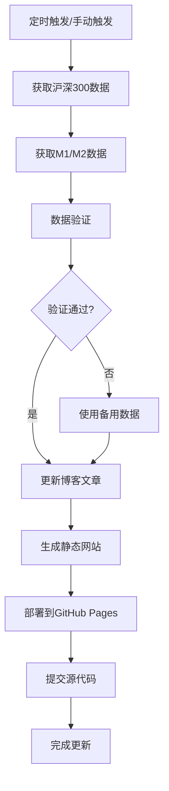

# 🚀 GitHub Actions自动化部署配置指南

## 📋 概览

您的博客现在支持完全自动化的数据更新！GitHub Actions将每个工作日上午9:30自动获取最新的市场数据并更新博客。

## ⚙️ 配置步骤

### 1. 设置GitHub Secrets（可选）

为了获取更准确的数据，建议配置以下API密钥：

1. **进入GitHub仓库设置**
   - 访问：https://github.com/SeaLeee/SeaLeee.github.io/settings/secrets/actions
   
2. **添加以下Secrets**：

   **TUSHARE_TOKEN**（推荐）
   ```
   名称: TUSHARE_TOKEN
   值: 您的Tushare API Token
   获取: https://tushare.pro/register
   ```

   **AKSHARE_TOKEN**（可选）
   ```
   名称: AKSHARE_TOKEN  
   值: 您的AKShare API Token（如果需要）
   ```

### 2. 验证自动化配置

1. **检查Workflow文件**
   - 文件位置：`.github/workflows/update-market-data.yml`
   - 自动触发：每工作日上午9:30 (北京时间)
   - 手动触发：Repository → Actions → "自动更新市场数据" → Run workflow

2. **监控执行状态**
   - 访问：https://github.com/SeaLeee/SeaLeee.github.io/actions
   - 查看运行日志和结果

## 🔄 自动化流程说明

### 执行时机
- **定时执行**：每工作日上午9:30（UTC 1:30）
- **手动执行**：GitHub Actions页面手动触发
- **跳过周末**：自动跳过周六日

### 数据获取顺序
1. **沪深300数据**：
   - 优先使用：AKShare库
   - 备用方案：Tushare API
   - 兜底方案：Yahoo Finance + 网络爬虫

2. **M1/M2数据**：
   - 优先使用：AKShare宏观数据
   - 备用方案：固定近期数据

### 更新流程


## 📊 数据说明

### 核心指标
- **沪深300指数**：反映A股整体表现
- **M1同比增速**：狭义货币，反映活跃资金
- **M2同比增速**：广义货币，反映总体流动性  
- **M1-M2差值**：流动性结构指标
  - 正值：资金更活跃，利好股市
  - 负值：资金相对沉淀，需谨慎

### 投资建议逻辑
```python
# 信号评分系统
signal_score = 0

# M1-M2差值权重最高
if m1_m2_diff > 0:     signal_score += 3  # 资金活跃
elif m1_m2_diff > -2:  signal_score += 1  # 合理范围
elif m1_m2_diff < -5:  signal_score -= 2  # 过度沉淀

# 沪深300涨跌幅
if hs300_change > 2:   signal_score += 1
elif hs300_change < -2: signal_score -= 1

# M2增速（流动性环境）
if m2_growth > 8.5:    signal_score += 1
elif m2_growth < 6.5:  signal_score -= 1

# 建议生成
if signal_score >= 4:   "积极乐观"
elif signal_score >= 2: "谨慎乐观"  
elif signal_score >= -1: "中性观望"
else:                   "谨慎"
```

## 🛠️ 故障排除

### 常见问题

1. **数据获取失败**
   ```
   原因：API限制或网络问题
   解决：系统自动使用备用数据源
   ```

2. **博客生成失败** 
   ```
   原因：Node.js依赖问题
   解决：检查package.json和workflow配置
   ```

3. **部署失败**
   ```
   原因：Git权限或分支问题  
   解决：检查deploy配置和分支设置
   ```

### 调试步骤

1. **查看Actions日志**
   - GitHub → Actions → 失败的workflow → 查看详细日志

2. **手动触发测试**
   - Actions页面 → "自动更新市场数据" → "Run workflow"

3. **本地测试脚本**
   ```bash
   cd new-blog/tools
   python fetch_market_data_github.py
   python update_blog_github.py
   ```

## 📈 监控与维护

### 每日检查
- 博客是否正常更新（访问网站确认）
- GitHub Actions是否成功执行
- 数据是否合理（关注异常波动）

### 定期维护
- **周度**：检查API使用量和限制
- **月度**：更新依赖包版本
- **季度**：优化数据获取逻辑

## 🎯 高级功能

### 扩展数据源
可以添加更多经济指标：
- GDP增速、CPI、PPI
- 美债收益率、人民币汇率
- 行业指数、概念板块指数

### 增强分析
- 技术指标计算（RSI、MACD等）
- 相关性分析和预测模型
- 历史回测和策略优化

### 通知功能
- 邮件通知：数据更新结果
- 微信通知：重要市场信号
- 短信通知：异常情况警报

---

**🎉 自动化配置完成！您的财经博客现在具备了完全自动化的数据更新能力！**

每个工作日上午，系统都会自动获取最新的市场数据，分析M1-M2流动性结构，并生成专业的投资建议，让您的博客始终保持最新、最有价值的内容。