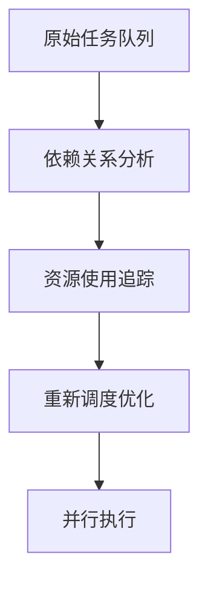

## 🎬 什么是计算机渲染？

想象一下，当你在电脑上看到精美的3D游戏画面，或者观看《阿凡达》这样的特效大片时，这些逼真的画面是如何创造出来的？答案就是**计算机渲染**。

### � 从生活中理解渲染

就像画家用画笔在画布上作画一样，计算机渲染就是让电脑"画"出我们想要的图像。但是：
- **画家**：用肉眼观察，凭经验调色，一笔一笔慢慢画
- **电脑**：用数学计算光线、色彩、阴影，每秒能"画"出几十张图片

### 🎯 为什么需要GPU？

早期的渲染都是用CPU（中央处理器）完成的，就像一个非常聪明的人独自工作：
- **CPU的特点**：很聪明，但只有4-16个"工人"
- **GPU的特点**：相对简单，但有成千上万个"工人"

渲染一张图片需要计算每个像素点的颜色，一张1920×1080的图片就有207万个像素。显然，让成千上万个工人并行工作会更快！

## �🚀 LuisaRender：革命性的渲染框架

**LuisaRender**是由清华大学BNRist实验室开发的下一代渲染框架。想象一下，如果传统的GPU编程是在用"方言"（每个厂商都有自己的语言），那么LuisaRender就是创造了一种"普通话"，让所有GPU都能听懂。

### 🤔 传统GPU编程的问题

在LuisaRender出现之前，开发者面临着这些困难：

<div style="background: #fff3cd; border: 1px solid #ffeaa7; border-radius: 8px; padding: 15px; margin: 20px 0;">
<h4 style="color: #d63031; margin-top: 0;">😅 痛点1：语言碎片化</h4>
<ul>
<li><strong>NVIDIA GPU</strong>：需要学CUDA语言</li>
<li><strong>Apple设备</strong>：需要学Metal语言</li>
<li><strong>Windows系统</strong>：需要学DirectX</li>
<li><strong>结果</strong>：写一个程序要学三种语言！</li>
</ul>
</div>

<div style="background: #fff3cd; border: 1px solid #ffeaa7; border-radius: 8px; padding: 15px; margin: 20px 0;">
<h4 style="color: #d63031; margin-top: 0;">😅 痛点2：代码分离</h4>
<ul>
<li><strong>主机代码</strong>：在CPU上运行，用C++写</li>
<li><strong>设备代码</strong>：在GPU上运行，用着色语言写</li>
<li><strong>结果</strong>：一个程序要用两种语言，很容易出错！</li>
</ul>
</div>

<div style="background: #fff3cd; border: 1px solid #ffeaa7; border-radius: 8px; padding: 15px; margin: 20px 0;">
<h4 style="color: #d63031; margin-top: 0;">😅 痛点3：性能优化困难</h4>
<ul>
<li>编译器不知道运行时的具体情况</li>
<li>无法根据实际数据进行优化</li>
<li><strong>结果</strong>：程序跑得不够快！</li>
</ul>
</div>

### ✨ LuisaRender的解决方案

LuisaRender就像一个超级翻译官+优化专家，它提供了四个核心创新：

<div style="background: #d1ecf1; border: 1px solid #bee5eb; border-radius: 8px; padding: 15px; margin: 20px 0;">
<h4 style="color: #0c5460; margin-top: 0;">🎯 创新1：统一编程语言</h4>
<p><strong>问题</strong>：要学很多种GPU语言<br>
<strong>解决</strong>：只用C++一种语言写所有代码！</p>
</div>

<div style="background: #d1ecf1; border: 1px solid #bee5eb; border-radius: 8px; padding: 15px; margin: 20px 0;">
<h4 style="color: #0c5460; margin-top: 0;">🎯 创新2：智能编译</h4>
<p><strong>问题</strong>：程序运行时才知道具体情况<br>
<strong>解决</strong>：运行时动态生成最优化的代码！</p>
</div>

<div style="background: #d1ecf1; border: 1px solid #bee5eb; border-radius: 8px; padding: 15px; margin: 20px 0;">
<h4 style="color: #0c5460; margin-top: 0;">🎯 创新3：自动适配</h4>
<p><strong>问题</strong>：不同GPU厂商API不同<br>
<strong>解决</strong>：自动翻译成各种GPU语言！</p>
</div>

<div style="background: #d1ecf1; border: 1px solid #bee5eb; border-radius: 8px; padding: 15px; margin: 20px 0;">
<h4 style="color: #0c5460; margin-top: 0;">🎯 创新4：极致性能</h4>
<p><strong>结果</strong>：比现有最好的渲染器快5-11倍！</p>
</div>

---

## 🧠 核心概念：什么是DSL？

在深入LuisaRender之前，我们需要理解几个关键概念：

### 📚 DSL（领域特定语言）简介

**DSL**全称是Domain-Specific Language，翻译过来就是"专门用途的语言"。

<div style="background: #e8f5e8; border: 1px solid #c3e6cb; border-radius: 8px; padding: 15px; margin: 20px 0;">
<h4 style="color: #155724; margin-top: 0;">🌰 生活中的DSL例子</h4>
<ul>
<li><strong>SQL</strong>：专门用来查询数据库的语言</li>
<li><strong>HTML</strong>：专门用来描述网页结构的语言</li>
<li><strong>正则表达式</strong>：专门用来匹配文本模式的语言</li>
</ul>
<p><strong>共同特点</strong>：虽然功能有限，但在特定领域内非常高效！</p>
</div>

### 🔧 什么是"嵌入式"DSL？

传统的DSL需要单独学习，而**嵌入式DSL**就是把专用语言"藏"在常用语言里：

```cpp
// 传统方式：需要学习新语言
SELECT name FROM users WHERE age > 18;

// 嵌入式DSL：用熟悉的语言表达
users.where(age > 18).select("name");
```

LuisaRender的创新就在于：**把GPU编程语言嵌入到C++中**，让你用熟悉的C++语法来编写GPU程序！

## 🏗️ LuisaRender架构：三层设计的巧思

想象LuisaRender是一座三层建筑，每层都有特定的职责：

<div style="background: #f8f9fa; padding: 25px; border-radius: 12px; margin: 25px 0; box-shadow: 0 2px 10px rgba(0,0,0,0.1);">

### 🏢 第三层：编程接口层（你直接使用的部分）

<div style="background: linear-gradient(135deg, #667eea 0%, #764ba2 100%); border-radius: 8px; padding: 20px; margin: 15px 0; color: white;">
<h4 style="color: white; margin: 0 0 15px 0;">🎨 这层负责什么？</h4>
<ul style="color: white;">
<li><strong>让你用C++写GPU程序</strong>：不需要学新语言</li>
<li><strong>自动理解你的代码</strong>：把C++转换成GPU能理解的指令</li>
<li><strong>智能优化</strong>：根据实际运行情况生成最快的代码</li>
</ul>
<p style="color: white; margin-bottom: 0;"><strong>类比</strong>：就像一个超级聪明的秘书，你用中文说话，它自动翻译成英文、日文、法文</p>
</div>

### 🏢 第二层：统一管理层（协调各种资源）

<div style="background: linear-gradient(135deg, #f093fb 0%, #f5576c 100%); border-radius: 8px; padding: 20px; margin: 15px 0; color: white;">
<h4 style="color: white; margin: 0 0 15px 0;">⚙️ 这层负责什么？</h4>
<ul style="color: white;">
<li><strong>管理GPU内存</strong>：分配图片、缓冲区等存储空间</li>
<li><strong>调度任务</strong>：决定什么时候运行哪个程序</li>
<li><strong>优化执行顺序</strong>：让GPU尽可能高效地工作</li>
</ul>
<p style="color: white; margin-bottom: 0;"><strong>类比</strong>：就像工厂的调度中心，安排工人、分配材料、优化生产线</p>
</div>

### 🏢 第一层：硬件适配层（与具体GPU对话）

<div style="background: linear-gradient(135deg, #4facfe 0%, #00f2fe 100%); border-radius: 8px; padding: 20px; margin: 15px 0; color: white;">
<h4 style="color: white; margin: 0 0 15px 0;">🔌 这层负责什么？</h4>
<ul style="color: white;">
<li><strong>NVIDIA GPU</strong>：翻译成CUDA语言</li>
<li><strong>Apple设备</strong>：翻译成Metal语言</li>
<li><strong>Windows系统</strong>：翻译成DirectX</li>
<li><strong>普通CPU</strong>：也能运行（虽然慢一些）</li>
</ul>
<p style="color: white; margin-bottom: 0;"><strong>类比</strong>：就像万能适配器，一个插头可以插到世界各国的电源插座上</p>
</div>

</div>

### � 为什么这样设计？

这种分层设计有三个巨大优势：

<div style="display: grid; grid-template-columns: repeat(auto-fit, minmax(250px, 1fr)); gap: 20px; margin: 20px 0;">

<div style="background: #d4edda; border: 1px solid #c3e6cb; border-radius: 8px; padding: 15px;">
<h4 style="color: #155724; margin-top: 0;">🎯 优势1：简单易用</h4>
<p>程序员只需要关心顶层，不用操心底层的复杂适配问题</p>
</div>

<div style="background: #d4edda; border: 1px solid #c3e6cb; border-radius: 8px; padding: 15px;">
<h4 style="color: #155724; margin-top: 0;">🔧 优势2：易于扩展</h4>
<p>要支持新的GPU？只需要添加一个新的适配层，其他都不用改</p>
</div>

<div style="background: #d4edda; border: 1px solid #c3e6cb; border-radius: 8px; padding: 15px;">
<h4 style="color: #155724; margin-top: 0;">⚡ 优势3：极致优化</h4>
<p>每层都专注于自己的优化，整体性能达到最佳</p>
</div>

</div>

---

## 💻 第一个核心技术：嵌入式DSL

### 🤔 传统GPU编程有多复杂？

让我们先看看传统方式写一个简单的GPU程序有多麻烦：

<div style="background: #f8d7da; border: 1px solid #f5c6cb; border-radius: 8px; padding: 15px; margin: 20px 0;">
<h4 style="color: #721c24; margin-top: 0;">😵‍💫 传统方式（需要写多个文件）</h4>

**第1步：写主机代码（main.cpp）**
```cpp
// 在CPU上运行的C++代码
int main() {
    // 初始化GPU
    // 编译着色器
    // 绑定参数
    // 启动GPU程序
    // 等待结果
}
```

**第2步：写GPU代码（shader.hlsl）**
```hlsl
// 在GPU上运行的着色器代码
[numthreads(16, 16, 1)]
void CSMain(uint3 id : SV_DispatchThreadID) {
    // GPU计算逻辑
}
```

**第3步：处理两者之间的通信**
```cpp
// 复杂的参数绑定和数据传递
device->CreateBuffer(...);
device->BindShaderResource(...);
device->Dispatch(...);
```
</div>

### ✨ LuisaRender的革命性简化

<div style="background: #d4edda; border: 1px solid #c3e6cb; border-radius: 8px; padding: 15px; margin: 20px 0;">
<h4 style="color: #155724; margin-top: 0;">😊 LuisaRender方式（只需要一个文件）</h4>

```cpp
#include <luisa/runtime/context.h>
using namespace luisa;

int main() {
    // 初始化设备
    Context context{argv[0]};
    auto device = context.create_device("cuda");
    
    // 直接用C++写GPU程序！
    Kernel2D my_gpu_program = [](ImageFloat output_image) {
        // 获取当前像素位置
        auto pixel_pos = dispatch_id().xy();
        
        // 计算颜色（创建彩虹效果）
        auto color = make_float3(
            float(pixel_pos.x) / 1024.0f,  // 红色分量
            float(pixel_pos.y) / 768.0f,   // 绿色分量
            0.5f                            // 蓝色分量
        );
        
        // 写入图像
        output_image.write(pixel_pos, make_float4(color, 1.0f));
    };
    
    // 编译并运行
    auto shader = device.compile(my_gpu_program);
    auto image = device.create_image<float>(RGBA32F, 1024, 768);
    
    stream << shader(image).dispatch(1024, 768) << synchronize();
    
    return 0;
}
```
</div>

### 🎯 这有什么好处？

<div style="display: grid; grid-template-columns: repeat(auto-fit, minmax(300px, 1fr)); gap: 20px; margin: 20px 0;">

<div style="background: #e2f3ff; border: 1px solid #b3d7ff; border-radius: 8px; padding: 15px;">
<h4 style="color: #0056b3; margin-top: 0;">✅ 好处1：更简单</h4>
<ul>
<li>只需要学一种语言：C++</li>
<li>不用管理多个文件</li>
<li>不用手动处理GPU-CPU通信</li>
</ul>
</div>

<div style="background: #e2f3ff; border: 1px solid #b3d7ff; border-radius: 8px; padding: 15px;">
<h4 style="color: #0056b3; margin-top: 0;">✅ 好处2：更安全</h4>
<ul>
<li>C++编译器帮你检查错误</li>
<li>类型安全，不容易出bug</li>
<li>IDE可以提供代码提示</li>
</ul>
</div>

<div style="background: #e2f3ff; border: 1px solid #b3d7ff; border-radius: 8px; padding: 15px;">
<h4 style="color: #0056b3; margin-top: 0;">✅ 好处3：更灵活</h4>
<ul>
<li>可以用C++的所有特性</li>
<li>可以动态生成GPU程序</li>
<li>可以运行时优化</li>
</ul>
</div>

</div>

### 🔍 深入理解：这是怎么实现的？

你可能会好奇：C++代码怎么能在GPU上运行呢？答案是**编译时魔法**！

<div style="background: #fff3cd; border: 1px solid #ffeaa7; border-radius: 8px; padding: 15px; margin: 20px 0;">
<h4 style="color: #856404; margin-top: 0;">🎭 编译时的"变身术"</h4>

**第1步：你写C++代码**
```cpp
auto color = make_float3(1.0f, 0.5f, 0.0f);
```

**第2步：LuisaRender分析代码结构**
```
AST节点: 变量声明
├── 类型: float3
├── 名称: color  
└── 初始值: 构造函数调用
    ├── 参数1: 1.0f
    ├── 参数2: 0.5f
    └── 参数3: 0.0f
```

**第3步：生成对应的GPU代码**
```hlsl
// NVIDIA GPU (CUDA)
float3 color = make_float3(1.0f, 0.5f, 0.0f);

// Apple设备 (Metal)  
float3 color = float3(1.0f, 0.5f, 0.0f);

// Windows (DirectX)
float3 color = float3(1.0f, 0.5f, 0.0f);
```
</div>

关键在于：**你的C++代码并不是真的在GPU上运行，而是被"翻译"成了GPU能理解的语言！**

### 📝 类型系统与变量

DSL的核心是`Var<T>`模板类，它作为内核变量的代理：

```cpp
template<typename T>
class Var { /* 内部实现 */ };

// 常用类型别名
using Int = Var<int>;
using Float3 = Var<float3>;
using ImageFloat = Var<Image<float>>;

// 变量定义示例
Int a = 42;                    // 整数变量
Float3 color{1.0f, 0.5f, 0.0f}; // 向量变量
auto b = def(256u);            // 类型推导
```

### 🎭 表达式与控制流

DSL提供了接近原生C++的语法体验：

```cpp
// 算术运算
auto result = a + b * 3.14f;

// 条件控制（注意$前缀）
$if (condition) {
    // true分支
} $else {
    // false分支
};

// 循环结构
$for (i, 0, 10) {
    // 循环体
};
```

### 🔄 函数与内核

支持两种设备函数类型：

```cpp
// 可调用函数
Callable to_srgb = [](Float3 x) {
    $if (x <= 0.00031308f) {
        x = 12.92f * x;
    } $else {
        x = 1.055f * pow(x, 1.0f / 2.4f) - 0.055f;
    };
    return x;
};

// 内核函数（并行入口点）
Kernel2D render = [&](ImageFloat image) {
    auto coord = dispatch_id().xy();
    auto size = make_float2(dispatch_size().xy());
    auto color = make_float2(coord) / size;
    
    auto srgb_color = to_srgb(make_float3(color, 1.0f));
    image.write(coord, make_float4(srgb_color, 1.0f));
};
```

---

## ⚡ 第二个核心技术：JIT智能编译

### 🤔 什么是JIT编译？

**JIT**全称是"Just-In-Time Compilation"，翻译过来就是"用到时才编译"。

<div style="background: #e8f5e8; border: 1px solid #c3e6cb; border-radius: 8px; padding: 15px; margin: 20px 0;">
<h4 style="color: #155724; margin-top: 0;">🌰 用做饭来理解JIT</h4>

**传统编译（提前做饭）**
- 早上就把晚餐准备好
- 不知道晚上有几个人吃饭
- 不知道客人的口味偏好
- **结果**：可能做多了浪费，或者不合口味

**JIT编译（现做现卖）**
- 客人来了才开始做菜
- 知道有几个人，知道口味
- 可以做最合适的分量和口味
- **结果**：既不浪费，又很对胃口！
</div>

### 🚀 LuisaRender的JIT优势

在GPU编程中，JIT带来了巨大的性能提升：

<div style="display: grid; grid-template-columns: repeat(auto-fit, minmax(300px, 1fr)); gap: 20px; margin: 20px 0;">

<div style="background: #fff3cd; border: 1px solid #ffeaa7; border-radius: 8px; padding: 15px;">
<h4 style="color: #856404; margin-top: 0;">⚡ 优化1：常量内联</h4>
<p><strong>运行前不知道</strong>：图片大小是1024×768还是4K？</p>
<p><strong>JIT知道后</strong>：直接把1024和768写死在代码里，省去变量查找时间</p>
</div>

<div style="background: #fff3cd; border: 1px solid #ffeaa7; border-radius: 8px; padding: 15px;">
<h4 style="color: #856404; margin-top: 0;">⚡ 优化2：分支消除</h4>
<p><strong>运行前不知道</strong>：用户选择了哪种材质？</p>
<p><strong>JIT知道后</strong>：只编译用户选择的材质代码，删除其他分支</p>
</div>

<div style="background: #fff3cd; border: 1px solid #ffeaa7; border-radius: 8px; padding: 15px;">
<h4 style="color: #856404; margin-top: 0;">⚡ 优化3：循环展开</h4>
<p><strong>运行前不知道</strong>：要计算几次光线反射？</p>
<p><strong>JIT知道后</strong>：如果只要3次，就展开成3段代码，避免循环开销</p>
</div>

</div>

### 🔍 JIT工作原理：从代码到优化

让我们通过一个具体例子看看JIT是如何工作的：

<div style="background: #e3f2fd; border: 1px solid #bbdefb; border-radius: 8px; padding: 15px; margin: 20px 0;">
<h4 style="color: #0d47a1; margin-top: 0;">📝 例子：模糊滤镜程序</h4>

**第1步：你写的通用代码**
```cpp
Kernel2D blur_filter = [](ImageFloat input, ImageFloat output, Int kernel_size) {
    auto pos = dispatch_id().xy();
    auto color = make_float3(0.0f);
    
    // 遍历周围像素
    for (int x = -kernel_size; x <= kernel_size; x++) {
        for (int y = -kernel_size; y <= kernel_size; y++) {
            color += input.read(pos + make_int2(x, y)).xyz();
        }
    }
    
    output.write(pos, make_float4(color / ((kernel_size*2+1) * (kernel_size*2+1)), 1.0f));
};
```

**第2步：运行时你指定 kernel_size = 3**

**第3步：JIT生成优化后的GPU代码**
```cpp
// JIT优化后的版本（伪代码）
__global__ void optimized_blur() {
    int2 pos = threadIdx.xy() + blockIdx.xy() * blockDim.xy();
    float3 color = make_float3(0.0f);
    
    // 循环已经展开，常量已经内联
    color += input.read(pos + make_int2(-3, -3)).xyz();
    color += input.read(pos + make_int2(-3, -2)).xyz();
    color += input.read(pos + make_int2(-3, -1)).xyz();
    // ... 总共49行（7×7）
    color += input.read(pos + make_int2(3, 3)).xyz();
    
    output.write(pos, make_float4(color / 49.0f, 1.0f));  // 49是常量
}
```
</div>

### 📊 性能提升有多大？

<div style="background: #f3e5f5; border: 1px solid #e1bee7; border-radius: 8px; padding: 20px; margin: 20px 0;">
<h4 style="color: #4a148c; margin-top: 0;">🏆 实测性能对比</h4>

<div style="display: flex; justify-content: space-around; flex-wrap: wrap; gap: 20px;">
<div style="text-align: center;">
<div style="font-size: 32px; font-weight: bold; color: #e74c3c;">1351秒</div>
<div style="font-size: 14px; color: #666;">传统方法(PBRT-v4)</div>
</div>
<div style="text-align: center;">
<div style="font-size: 32px; font-weight: bold; color: #f39c12;">1235秒</div>
<div style="font-size: 14px; color: #666;">改进方法(Mitsuba3)</div>
</div>
<div style="text-align: center;">
<div style="font-size: 32px; font-weight: bold; color: #27ae60;">241秒</div>
<div style="font-size: 14px; color: #666;">LuisaRender</div>
</div>
</div>

<div style="text-align: center; margin-top: 15px; font-size: 18px; font-weight: bold; color: #27ae60;">
⚡ 比最好的传统方法快了5.6倍！
</div>
</div>

### 🎯 多阶段编程

DSL实现了动态的多阶段编程模式：

```cpp
// 主机端：编译时已知的信息
constexpr int MAX_BOUNCES = 16;

// 设备端：运行时生成的特化代码
auto create_path_tracer = [](int bounces) {
    return Kernel2D([=](ImageFloat image, BufferFloat samples) {
        // 使用运行时参数进行循环展开
        for (int i = 0; i < bounces; ++i) {
            // 自动内联和常量传播
        }
    });
};
```

### 🧬 动态多态性

提供两种多态机制：

**1. 主机端去虚拟化**
```cpp
// 主机端动态调用
auto create_kernel(function<Float3(Float3)> op) {
    return Kernel2D([&op](ImageFloat image) {
        auto color = image.read(pos);
        // op()在设备代码中被静态展开
        auto mapped = op(color.xyz());
        image.write(pos, make_float4(mapped, color.w));
    });
};
```

**2. 设备端动态分发**
```cpp
class BRDFEvaluator {
    Polymorphic<BRDF> _brdf;
public:
    auto evaluate(Hit hit, Float3 wo, Float3 wi) {
        Eval result;
        _brdf->dispatch(hit->brdf_tag(), [&](auto f) {
            result = f->eval(wo, wi);
        });
        return result;
    }
};
```

---

## 🌐 第三个核心技术：统一运行时

### 🤔 为什么需要统一运行时？

想象你是一个国际餐厅老板，要在世界各地开分店：

<div style="background: #f8d7da; border: 1px solid #f5c6cb; border-radius: 8px; padding: 15px; margin: 20px 0;">
<h4 style="color: #721c24; margin-top: 0;">😫 没有统一标准的痛苦</h4>
<ul>
<li><strong>中国分店</strong>：用人民币结账，菜单写中文</li>
<li><strong>美国分店</strong>：用美元结账，菜单写英文</li>
<li><strong>日本分店</strong>：用日元结账，菜单写日文</li>
</ul>
<p><strong>结果</strong>：你要学会三种货币、三种语言，管理成本极高！</p>
</div>

<div style="background: #d4edda; border: 1px solid #c3e6cb; border-radius: 8px; padding: 15px; margin: 20px 0;">
<h4 style="color: #155724; margin-top: 0;">� 有了统一标准的好处</h4>
<ul>
<li><strong>统一菜单</strong>：所有分店用同样的菜单格式</li>
<li><strong>统一支付</strong>：都接受国际信用卡</li>
<li><strong>统一管理</strong>：一套管理系统管理全球分店</li>
</ul>
<p><strong>结果</strong>：你只需要学一套标准，就能管理全球业务！</p>
</div>

### 🎯 LuisaRender的统一运行时

同样的道理，GPU编程也面临"多国分店"的问题：

<div style="display: grid; grid-template-columns: repeat(auto-fit, minmax(250px, 1fr)); gap: 20px; margin: 20px 0;">

<div style="background: #e3f2fd; border: 1px solid #bbdefb; border-radius: 8px; padding: 15px;">
<h4 style="color: #0d47a1; margin-top: 0;">🔧 NVIDIA GPU</h4>
<ul>
<li>语言：CUDA</li>
<li>内存管理：cudaMalloc()</li>
<li>程序启动：kernel<<<>>>()</li>
</ul>
</div>

<div style="background: #e3f2fd; border: 1px solid #bbdefb; border-radius: 8px; padding: 15px;">
<h4 style="color: #0d47a1; margin-top: 0;">🍎 Apple设备</h4>
<ul>
<li>语言：Metal</li>
<li>内存管理：newBufferWithLength()</li>
<li>程序启动：dispatchThreadgroups()</li>
</ul>
</div>

<div style="background: #e3f2fd; border: 1px solid #bbdefb; border-radius: 8px; padding: 15px;">
<h4 style="color: #0d47a1; margin-top: 0;">🪟 Windows系统</h4>
<ul>
<li>语言：DirectX/HLSL</li>
<li>内存管理：CreateBuffer()</li>
<li>程序启动：Dispatch()</li>
</ul>
</div>

</div>

**统一运行时就像一个超级翻译官**，把你的统一指令翻译成各种GPU的"方言"：

### 🔄 统一接口的魔法

<div style="background: #e8f5e8; border: 1px solid #c3e6cb; border-radius: 8px; padding: 15px; margin: 20px 0;">
<h4 style="color: #155724; margin-top: 0;">✨ 你只需要学一套API</h4>

```cpp
// 你写的统一代码
auto device = context.create_device("auto");  // 自动选择最佳GPU
auto buffer = device.create_buffer<float>(1000);  // 创建缓冲区
auto image = device.create_image<float>(1024, 768);  // 创建图像

// LuisaRender自动翻译成：
// NVIDIA GPU: cudaMalloc(), cuTexCreate()
// Apple设备: newBufferWithLength(), newTextureWithDescriptor()
// Windows: CreateBuffer(), CreateTexture2D()
```
</div>

### 🧠 智能资源管理

统一运行时不只是翻译，它还很聪明：

<div style="background: #fff3cd; border: 1px solid #ffeaa7; border-radius: 8px; padding: 15px; margin: 20px 0;">
<h4 style="color: #856404; margin-top: 0;">🤖 自动优化调度</h4>

**问题场景**：你要运行3个GPU程序
```cpp
program1(imageA, bufferB);  // 只读imageA，写bufferB
program2(imageA, bufferC);  // 只读imageA，写bufferC  
program3(bufferB, bufferC, imageD);  // 读bufferB和bufferC，写imageD
```

**传统方式**：必须按顺序执行
```
program1 → 等待完成 → program2 → 等待完成 → program3
总时间：300ms
```

**LuisaRender智能调度**：发现program1和program2可以同时运行
```
program1 ↘
            → program3  
program2 ↗
总时间：200ms（快了33%！）
```
</div>

### 🎮 实际使用效果

<div style="background: #e2f3ff; border: 1px solid #b3d7ff; border-radius: 8px; padding: 15px; margin: 20px 0;">
<h4 style="color: #0056b3; margin-top: 0;">🚀 一次编写，到处运行</h4>

```cpp
// 同一份代码，在不同设备上运行
auto device1 = context.create_device("cuda");    // NVIDIA GPU
auto device2 = context.create_device("metal");   // Apple GPU  
auto device3 = context.create_device("dx");      // Windows GPU
auto device4 = context.create_device("cpu");     // 普通CPU

// 同样的渲染程序，自动适配所有平台
auto shader = device1.compile(my_render_kernel);  // CUDA版本
auto shader = device2.compile(my_render_kernel);  // Metal版本
auto shader = device3.compile(my_render_kernel);  // DirectX版本
auto shader = device4.compile(my_render_kernel);  // CPU版本
```

<p style="text-align: center; font-weight: bold; color: #0056b3; margin-bottom: 0;">
真正实现了"编写一次，到处运行"的梦想！ 🎯
</p>
</div>

### 📦 资源管理系统

框架提供了多种设备资源类型：

<div style="background: linear-gradient(135deg, #667eea 0%, #764ba2 100%); color: white; padding: 20px; border-radius: 10px; margin: 20px 0;">

#### 资源类型总览

- **缓冲区（Buffers）**：线性内存存储结构化数据
- **纹理（Textures）**：2D/3D图像，支持硬件采样优化
- **无绑定数组（Bindless Arrays）**：减少参数绑定开销的引用槽位
- **网格和加速结构**：硬件加速的光线相交测试
- **着色器（Shaders）**：编译后的计算管线对象
- **流和事件**：命令提交和同步机制

</div>

### 🎛️ 命令编码与调度

采用基于命令的异步执行模型：

```cpp
// 创建命令缓冲区
auto command_buffer = stream.command_buffer();

// 编码渲染管线
command_buffer
    << raytrace_shader(framebuffer, accel, resolution).dispatch(resolution)
    << accumulate_shader(accum_image, framebuffer).dispatch(resolution)
    << hdr2ldr_shader(accum_image, ldr_image).dispatch(resolution)
    << ldr_image.copy_to(host_image.data())
    << commit();
```

### 🧠 智能资源追踪

运行时自动分析资源使用模式并优化调度：



---

## 🔌 后端实现：多平台适配

### 🎪 支持的后端平台

LuisaRender目前支持5种后端实现：

<div style="display: grid; grid-template-columns: repeat(auto-fit, minmax(300px, 1fr)); gap: 20px; margin: 20px 0;">

<div style="background: #f8f9fa; padding: 15px; border-radius: 8px; border-left: 4px solid #28a745;">
<h4 style="color: #28a745; margin: 0 0 10px 0;">🟢 CUDA Backend</h4>
<p>NVIDIA GPU平台，支持OptiX光线追踪</p>
</div>

<div style="background: #f8f9fa; padding: 15px; border-radius: 8px; border-left: 4px solid #007bff;">
<h4 style="color: #007bff; margin: 0 0 10px 0;">🔵 Metal Backend</h4>
<p>Apple平台专用，优化M1/M2芯片</p>
</div>

<div style="background: #f8f9fa; padding: 15px; border-radius: 8px; border-left: 4px solid #6f42c1;">
<h4 style="color: #6f42c1; margin: 0 0 10px 0;">🟣 DirectX Backend</h4>
<p>Windows平台，支持DXR光线追踪</p>
</div>

<div style="background: #f8f9fa; padding: 15px; border-radius: 8px; border-left: 4px solid #fd7e14;">
<h4 style="color: #fd7e14; margin: 0 0 10px 0;">🟠 ISPC Backend</h4>
<p>CPU向量化并行处理</p>
</div>

<div style="background: #f8f9fa; padding: 15px; border-radius: 8px; border-left: 4px solid #dc3545;">
<h4 style="color: #dc3545; margin: 0 0 10px 0;">🔴 LLVM Backend</h4>
<p>标量CPU处理器支持</p>
</div>

</div>

### 🔄 代码生成流程

不同后端采用不同的代码生成策略：

```cpp
// AST → 原生着色语言（CUDA/Metal/DirectX/ISPC）
DSL_AST → CUDA_Kernel   // __global__ functions
        → Metal_Kernel  // kernel functions  
        → HLSL_Shader   // compute shaders
        → ISPC_Code     // vectorized C

// AST → LLVM IR（LLVM后端）
DSL_AST → LLVM_IR → Machine_Code
```

---

## 📊 性能表现：突破性提升

### 🏆 基准测试结果

<div style="background: white; padding: 25px; border-radius: 12px; margin: 25px 0; box-shadow: 0 4px 15px rgba(0,0,0,0.1);">

<h3 style="text-align: center; color: #2c3e50; margin: 0 0 30px 0;">渲染性能对比</h3>

<div style="display: grid; grid-template-columns: 1fr 1fr; gap: 30px;">

<div>
<h4 style="color: #2c3e50; text-align: center;">Classroom场景</h4>
<div style="background: #f8f9fa; padding: 15px; border-radius: 8px; text-align: center;">
<div style="font-size: 24px; font-weight: bold; color: #e74c3c; margin-bottom: 5px;">PBRT-v4: 1351s</div>
<div style="font-size: 24px; font-weight: bold; color: #f39c12; margin-bottom: 5px;">Mitsuba3: 1235s</div>
<div style="font-size: 24px; font-weight: bold; color: #27ae60; margin-bottom: 5px;">LuisaRender: 241s/203s</div>
<div style="font-size: 14px; color: #7f8c8d;">CUDA/DirectX</div>
</div>
</div>

<div>
<h4 style="color: #2c3e50; text-align: center;">Living Room场景</h4>
<div style="background: #f8f9fa; padding: 15px; border-radius: 8px; text-align: center;">
<div style="font-size: 24px; font-weight: bold; color: #e74c3c; margin-bottom: 5px;">PBRT-v4: 1220s</div>
<div style="font-size: 24px; font-weight: bold; color: #f39c12; margin-bottom: 5px;">Mitsuba3: 987s</div>
<div style="font-size: 24px; font-weight: bold; color: #27ae60; margin-bottom: 5px;">LuisaRender: 213s/180s</div>
<div style="font-size: 14px; color: #7f8c8d;">CUDA/DirectX</div>
</div>
</div>

</div>

<div style="background: linear-gradient(135deg, #2ecc71 0%, #27ae60 100%); color: white; padding: 15px; border-radius: 8px; margin-top: 20px; text-align: center;">
<h4 style="color: white; margin: 0 0 10px 0;">🚀 性能提升总结</h4>
<p style="margin: 0; font-size: 16px;">
<strong>相比PBRT-v4：5.5-11倍提升</strong> | <strong>相比Mitsuba3：4.5-16倍提升</strong>
</p>
</div>

</div>

### 🔍 性能优势来源

**1. JIT编译优化**
- 运行时常量传播和死代码消除
- 场景特定的循环展开和内联
- 动态分支预测优化

**2. 统一运行时效率**
- 自动资源依赖分析和并行调度
- 零拷贝资源管理
- 硬件特性充分利用

**3. 多态去虚拟化**
- 编译时多态分发消除间接调用
- 寄存器压力减少
- 分支预测优化

---

## � 完整实例：从入门到实战

### � 入门级例子：制作彩虹图片

让我们从最简单的例子开始，体验LuisaRender的魅力：

<div style="background: #e8f5e8; border: 1px solid #c3e6cb; border-radius: 8px; padding: 15px; margin: 20px 0;">
<h4 style="color: #155724; margin-top: 0;">🌈 目标：生成一张彩虹渐变图片</h4>

```cpp
#include <luisa/runtime/context.h>
#include <luisa/dsl/syntax.h>

int main() {
    // 第1步：初始化LuisaRender
    Context context{"my_first_gpu_program"};
    auto device = context.create_device("auto");  // 自动选择最佳GPU
    
    // 第2步：写GPU程序（就像写普通C++！）
    Kernel2D rainbow_generator = [](ImageFloat output) {
        // 获取当前像素坐标
        auto pixel = dispatch_id().xy();           // 例如：(100, 200)
        auto image_size = dispatch_size().xy();    // 例如：(1024, 768)
        
        // 将像素坐标转换为0-1范围
        auto uv = make_float2(pixel) / make_float2(image_size);
        
        // 生成彩虹色：红-橙-黄-绿-青-蓝-紫
        auto hue = uv.x * 360.0f;  // 水平方向控制色相
        auto saturation = 1.0f;     // 饱和度固定
        auto brightness = uv.y;     // 垂直方向控制亮度
        
        // HSV转RGB（这里简化处理）
        auto color = make_float3(
            sin(hue * 3.14159f / 180.0f) * 0.5f + 0.5f,    // 红色分量
            sin((hue + 120.0f) * 3.14159f / 180.0f) * 0.5f + 0.5f,  // 绿色分量
            sin((hue + 240.0f) * 3.14159f / 180.0f) * 0.5f + 0.5f   // 蓝色分量
        ) * brightness;
        
        // 写入图片
        output.write(pixel, make_float4(color, 1.0f));
    };
    
    // 第3步：编译并创建资源
    auto shader = device.compile(rainbow_generator);
    auto rainbow_image = device.create_image<float>(RGBA32F, 1024, 768);
    
    // 第4步：执行GPU程序
    auto stream = device.create_stream();
    stream << shader(rainbow_image).dispatch(1024, 768)  // 启动GPU
           << synchronize();                              // 等待完成
    
    // 第5步：保存结果
    // rainbow_image.save("my_rainbow.png");
    
    return 0;
}
```

**运行结果**：你会得到一张1024×768的彩虹渐变图片！ 🌈
</div>

### 🎮 进阶例子：实时模糊滤镜

<div style="background: #e3f2fd; border: 1px solid #bbdefb; border-radius: 8px; padding: 15px; margin: 20px 0;">
<h4 style="color: #0d47a1; margin-top: 0;">📸 目标：对图片应用高斯模糊效果</h4>

```cpp
// 可复用的模糊函数
Callable gaussian_blur = [](ImageFloat input, Int2 pos, Float radius) {
    auto color = make_float3(0.0f);
    auto total_weight = 0.0f;
    
    // 在radius范围内采样周围像素
    auto sample_range = int(radius * 2);
    for (int dx = -sample_range; dx <= sample_range; dx++) {
        for (int dy = -sample_range; dy <= sample_range; dy++) {
            auto offset = make_int2(dx, dy);
            auto sample_pos = pos + offset;
            
            // 计算高斯权重
            auto distance = sqrt(float(dx*dx + dy*dy));
            auto weight = exp(-(distance * distance) / (2.0f * radius * radius));
            
            // 累积颜色
            auto sample_color = input.read(sample_pos).xyz();
            color += sample_color * weight;
            total_weight += weight;
        }
    }
    
    return color / total_weight;
};

// 主程序
Kernel2D blur_filter = [&](ImageFloat input, ImageFloat output, Float blur_strength) {
    auto pixel = dispatch_id().xy();
    auto blurred_color = gaussian_blur(input, pixel, blur_strength);
    output.write(pixel, make_float4(blurred_color, 1.0f));
};
```
</div>

### 🎬 专业级例子：简化版光线追踪

现在让我们挑战一个专业级的例子——光线追踪渲染器：

<div style="background: #f3e5f5; border: 1px solid #e1bee7; border-radius: 8px; padding: 15px; margin: 20px 0;">
<h4 style="color: #4a148c; margin-top: 0;">🎥 目标：实现基础的光线追踪渲染</h4>

```cpp
// 定义场景中的球体
struct Sphere {
    float3 center;
    float radius;
    float3 color;
};

// 光线-球体相交测试
Callable ray_sphere_intersect = [](Float3 ray_pos, Float3 ray_dir, Sphere sphere) {
    auto oc = ray_pos - sphere.center;
    auto a = dot(ray_dir, ray_dir);
    auto b = 2.0f * dot(oc, ray_dir);
    auto c = dot(oc, oc) - sphere.radius * sphere.radius;
    auto discriminant = b * b - 4.0f * a * c;
    
    $if (discriminant < 0.0f) {
        return -1.0f;  // 没有相交
    } $else {
        return (-b - sqrt(discriminant)) / (2.0f * a);  // 返回距离
    };
};

// 主渲染内核
Kernel2D simple_raytracer = [&](ImageFloat framebuffer, Buffer<Sphere> spheres) {
    auto pixel = dispatch_id().xy();
    auto resolution = dispatch_size().xy();
    
    // 生成相机光线
    auto uv = (make_float2(pixel) - make_float2(resolution) * 0.5f) / float(resolution.y);
    auto ray_origin = make_float3(0.0f, 0.0f, -5.0f);
    auto ray_direction = normalize(make_float3(uv.x, uv.y, 1.0f));
    
    // 初始化颜色
    auto color = make_float3(0.1f, 0.2f, 0.3f);  // 天空色
    auto closest_distance = 1000000.0f;
    
    // 测试与所有球体的相交
    $for (i, 3) {  // 假设有3个球体
        auto sphere = spheres.read(i);
        auto distance = ray_sphere_intersect(ray_origin, ray_direction, sphere);
        
        $if (distance > 0.0f && distance < closest_distance) {
            closest_distance = distance;
            
            // 计算简单的光照
            auto hit_point = ray_origin + ray_direction * distance;
            auto normal = normalize(hit_point - sphere.center);
            auto light_dir = normalize(make_float3(1.0f, 1.0f, -1.0f));
            auto light_intensity = max(0.0f, dot(normal, light_dir));
            
            color = sphere.color * light_intensity;
        };
    };
    
    framebuffer.write(pixel, make_float4(color, 1.0f));
};
```

**这段代码做了什么？**
1. **生成光线**：从相机位置向每个像素发射光线
2. **相交测试**：检测光线是否撞到球体
3. **光照计算**：计算撞击点的光照效果
4. **颜色输出**：将最终颜色写入图片
</div>

### 🎯 关键优势总结

通过这些例子，我们可以看到LuisaRender的核心优势：

<div style="display: grid; grid-template-columns: repeat(auto-fit, minmax(300px, 1fr)); gap: 20px; margin: 20px 0;">

<div style="background: #d4edda; border: 1px solid #c3e6cb; border-radius: 8px; padding: 15px;">
<h4 style="color: #155724; margin-top: 0;">✅ 简单易学</h4>
<ul>
<li>只需要会C++，不用学新语言</li>
<li>代码结构清晰，容易理解</li>
<li>强大的IDE支持和错误检查</li>
</ul>
</div>

<div style="background: #d4edda; border: 1px solid #c3e6cb; border-radius: 8px; padding: 15px;">
<h4 style="color: #155724; margin-top: 0;">🚀 性能卓越</h4>
<ul>
<li>JIT编译带来极致优化</li>
<li>比传统方法快5-11倍</li>
<li>充分利用GPU并行计算能力</li>
</ul>
</div>

<div style="background: #d4edda; border: 1px solid #c3e6cb; border-radius: 8px; padding: 15px;">
<h4 style="color: #155724; margin-top: 0;">🌐 跨平台兼容</h4>
<ul>
<li>一套代码支持所有GPU</li>
<li>自动适配不同硬件平台</li>
<li>从手机到工作站全覆盖</li>
</ul>
</div>

</div>

### 🔬 高级特性展示

**动态材质系统**
```cpp
// 多态BRDF系统
class MaterialSystem {
    Polymorphic<BRDF> brdf_dispatch;
    
public:
    void register_materials() {
        auto lambert_tag = brdf_dispatch.create<Lambertian>();
        auto metal_tag = brdf_dispatch.create<Metal>();
        auto glass_tag = brdf_dispatch.create<Glass>();
    }
    
    Callable create_evaluator() {
        return [&](UInt material_id, Float3 wo, Float3 wi) {
            Float3 result;
            brdf_dispatch->dispatch(material_id, [&](auto brdf) {
                result = brdf->eval(wo, wi);
            });
            return result;
        };
    }
};
```

**自适应采样**
```cpp
Kernel2D adaptive_sampler = [](ImageFloat variance_buffer, 
                               BufferUInt sample_counts) {
    auto pixel = dispatch_id().xy();
    auto variance = variance_buffer.read(pixel).x;
    
    // 基于方差的自适应采样
    auto base_samples = 64u;
    auto adaptive_samples = base_samples;
    
    $if (variance > 0.1f) {
        adaptive_samples *= 4u;  // 高方差区域增加采样
    } $elif (variance < 0.01f) {
        adaptive_samples /= 2u;  // 低方差区域减少采样
    };
    
    sample_counts.write(pixel.y * dispatch_size().x + pixel.x, adaptive_samples);
};
```

---

## 🌟 LuisaRender的重大意义

### � 为什么这项技术如此重要？

<div style="background: #e8f5e8; border: 1px solid #c3e6cb; border-radius: 8px; padding: 15px; margin: 20px 0;">
<h4 style="color: #155724; margin-top: 0;">🌍 改变了GPU编程的游戏规则</h4>

**以前的情况**：
- 学GPU编程 = 学3-4种不同的语言
- 写一个程序 = 要写多个版本
- 优化性能 = 需要深厚的专业知识

**LuisaRender带来的改变**：
- 学GPU编程 = 只需要会C++
- 写一个程序 = 自动支持所有平台
- 优化性能 = 框架自动完成
</div>

### 🚀 对不同群体的价值

<div style="display: grid; grid-template-columns: repeat(auto-fit, minmax(300px, 1fr)); gap: 20px; margin: 20px 0;">

<div style="background: #e3f2fd; border: 1px solid #bbdefb; border-radius: 8px; padding: 15px;">
<h4 style="color: #0d47a1; margin-top: 0;">👨‍💻 对程序员</h4>
<ul>
<li><strong>学习成本降低</strong>：不用学多种GPU语言</li>
<li><strong>开发效率提升</strong>：一套代码跨所有平台</li>
<li><strong>性能自动优化</strong>：不用手动调优</li>
</ul>
</div>

<div style="background: #f3e5f5; border: 1px solid #e1bee7; border-radius: 8px; padding: 15px;">
<h4 style="color: #4a148c; margin-top: 0;">🏢 对公司</h4>
<ul>
<li><strong>开发成本减少</strong>：不用维护多套代码</li>
<li><strong>产品性能提升</strong>：更快的渲染速度</li>
<li><strong>市场机会扩大</strong>：轻松支持所有平台</li>
</ul>
</div>

<div style="background: #fff3cd; border: 1px solid #ffeaa7; border-radius: 8px; padding: 15px;">
<h4 style="color: #856404; margin-top: 0;">🎮 对用户</h4>
<ul>
<li><strong>更好的视觉体验</strong>：更逼真的游戏画面</li>
<li><strong>更快的渲染速度</strong>：更短的等待时间</li>
<li><strong>更广的设备支持</strong>：在任何设备上都能享受</li>
</ul>
</div>

</div>

### � 未来发展方向

<div style="background: #d1ecf1; border: 1px solid #bee5eb; border-radius: 8px; padding: 20px; margin: 20px 0;">
<h4 style="color: #0c5460; margin-top: 0;">🛣️ 技术演进路线</h4>

**近期发展（1-2年）**
- 支持更多GPU平台（如WebGPU，让浏览器也能跑）
- 完善开发工具（调试器、性能分析器）
- 扩展材质和光照效果库

**中期目标（3-5年）**
- 集成人工智能辅助渲染
- 优化实时光线追踪技术
- 支持云端分布式渲染

**长远愿景（5-10年）**
- 探索量子计算在渲染中的应用
- 实现完全自动的渲染优化
- 普及到移动设备和嵌入式系统
</div>

### 💡 对学习者的建议

如果你对这项技术感兴趣，这里是学习路线：

<div style="background: #e2f3ff; border: 1px solid #b3d7ff; border-radius: 8px; padding: 15px; margin: 20px 0;">
<h4 style="color: #0056b3; margin-top: 0;">📚 推荐学习路径</h4>

**第1阶段：基础准备**
- 学好现代C++（C++17/20特性）
- 了解计算机图形学基本概念
- 熟悉线性代数和3D数学

**第2阶段：框架入门**
- 阅读LuisaRender官方文档
- 从简单的例子开始练习
- 理解DSL和JIT编译原理

**第3阶段：深入实践**
- 实现自己的渲染器
- 参与开源项目贡献
- 研究性能优化技术

**第4阶段：专业发展**
- 关注学术前沿动态
- 参加图形学会议和社区
- 探索新的应用领域
</div>

---

## 📚 学习资源与社区

### 🔗 官方资源

- **项目主页**：[luisa-render.com](https://luisa-render.com/)
- **开源代码**：[GitHub - LuisaGroup](https://github.com/LuisaGroup)
- **技术论文**：SIGGRAPH Asia 2022论文
- **技术文档**：完整的API参考和教程

### 👥 社区参与

**研究团队**
- 清华大学BNRist实验室
- 加州大学河滨分校
- Recreate Games

**贡献方向**
- 新后端平台实现
- 渲染算法优化
- 工具链完善
- 文档和教程

### 📖 推荐学习路径

1. **基础准备**：现代C++（C++17/20）、计算机图形学基础
2. **框架理解**：阅读论文和文档，理解架构设计
3. **实践应用**：从简单示例开始，逐步实现复杂渲染器
4. **深入研究**：研究JIT编译和GPU架构优化
5. **社区贡献**：参与开源项目，推动技术发展

---

## 🎯 总结：一场GPU编程的革命

### 🏆 LuisaRender到底解决了什么问题？

<div style="background: linear-gradient(135deg, #667eea 0%, #764ba2 100%); color: white; padding: 25px; border-radius: 12px; margin: 25px 0;">

<h4 style="color: white; margin-top: 0;">🎯 三个核心突破</h4>

<div style="display: grid; grid-template-columns: repeat(auto-fit, minmax(200px, 1fr)); gap: 20px; margin: 20px 0;">

<div style="text-align: center;">
<div style="font-size: 48px; margin-bottom: 10px;">🎨</div>
<h5 style="color: white; margin: 0 0 10px 0;">简化编程</h5>
<p style="color: white; margin: 0; font-size: 14px;">从"学3种语言"到"只用C++"</p>
</div>

<div style="text-align: center;">
<div style="font-size: 48px; margin-bottom: 10px;">⚡</div>
<h5 style="color: white; margin: 0 0 10px 0;">极致性能</h5>
<p style="color: white; margin: 0; font-size: 14px;">比最好的方法快5-11倍</p>
</div>

<div style="text-align: center;">
<div style="font-size: 48px; margin-bottom: 10px;">🌐</div>
<h5 style="color: white; margin: 0 0 10px 0;">统一平台</h5>
<p style="color: white; margin: 0; font-size: 14px;">一次编写，到处运行</p>
</div>

</div>

</div>

### 🌟 为什么说这是一场革命？

<div style="display: grid; grid-template-columns: 1fr 1fr; gap: 30px; margin: 20px 0;">

<div style="background: #f8d7da; border: 1px solid #f5c6cb; border-radius: 8px; padding: 20px;">
<h4 style="color: #721c24; margin-top: 0;">😓 革命前：GPU编程的痛苦</h4>
<ul>
<li>学习门槛高，需要专业知识</li>
<li>开发效率低，要写多套代码</li>
<li>性能优化难，需要手工调节</li>
<li>平台碎片化，兼容性差</li>
</ul>
</div>

<div style="background: #d4edda; border: 1px solid #c3e6cb; border-radius: 8px; padding: 20px;">
<h4 style="color: #155724; margin-top: 0;">😊 革命后：GPU编程的简单</h4>
<ul>
<li>学习门槛低，会C++就行</li>
<li>开发效率高，一套代码通用</li>
<li>性能自动优化，智能调节</li>
<li>平台统一化，完美兼容</li>
</ul>
</div>

</div>

### � 这项技术的真正价值

<div style="background: #fff3cd; border: 1px solid #ffeaa7; border-radius: 8px; padding: 20px; margin: 20px 0;">
<h4 style="color: #856404; margin-top: 0;">💎 不只是技术进步，更是思维革命</h4>

LuisaRender最大的贡献不是具体的技术实现，而是证明了一个重要观点：

<div style="text-align: center; font-size: 18px; font-weight: bold; color: #856404; margin: 15px 0; padding: 15px; background: rgba(255,235,59,0.2); border-radius: 8px;">
"高级抽象"和"极致性能"不是对立的，而是可以统一的！
</div>

这打破了长期以来的技术偏见：
- ❌ **旧观念**：要性能就得写低级代码，要易用就得牺牲性能
- ✅ **新理念**：通过智能编译，既能简单易用，又能极致高效

</div>

### 🚀 对未来的启发

LuisaRender的成功为整个计算机科学界提供了重要启发：

<div style="background: #e2f3ff; border: 1px solid #b3d7ff; border-radius: 8px; padding: 20px; margin: 20px 0;">
<h4 style="color: #0056b3; margin-top: 0;">🔮 技术发展新方向</h4>
<ul>
<li><strong>编程语言设计</strong>：嵌入式DSL将成为主流趋势</li>
<li><strong>编译器技术</strong>：JIT编译在各领域的应用前景广阔</li>
<li><strong>跨平台开发</strong>：统一抽象层的重要性日益凸显</li>
<li><strong>性能优化</strong>：智能化优化将替代手工调优</li>
</ul>
</div>

### 🎯 最后的话

作为技术爱好者，我们见证了GPU编程从"专家专用"到"人人可用"的转变。LuisaRender不仅是一个优秀的渲染框架，更是未来技术发展的风向标。

**它告诉我们**：真正的技术创新不是让简单的事情变复杂，而是让复杂的事情变简单。

**它启发我们**：最好的技术应该是无感的——用户感受到的是强大的功能，而不是复杂的使用方式。

在GPU计算日益重要的今天，LuisaRender为我们展示了一个更美好的未来：每个程序员都能轻松驾驭GPU的强大计算能力，创造出更精彩的数字世界！ 🌟

---

## 🏷️ 参考文献

1. Zheng, S., Zhou, Z., Chen, X., Yan, D., Zhang, C., Geng, Y., Gu, Y., & Xu, K. (2022). LuisaRender: A High-Performance Rendering Framework with Layered and Unified Interfaces on Stream Architectures. *ACM Transactions on Graphics*, 41(6), Article 232.

2. LuisaRender Official Website. https://luisa-render.com/

3. 知乎用户. (2023). 如何评价清华大学开源的高性能渲染框架LuisaRender？. 知乎. https://www.zhihu.com/question/604591389/answer/3108027153

4. LuisaGroup. (2022). LuisaRender Official Repository. GitHub. https://github.com/LuisaGroup

5. 徐昆, et al. (2022). 面向流处理器架构的高性能渲染框架设计与实现. 清华大学BNRist实验室技术报告.

---

*本文基于LuisaRender官方论文和技术文档编写，旨在为中文技术社区提供深入的技术解析。如需了解最新进展，请关注项目官方渠道。*